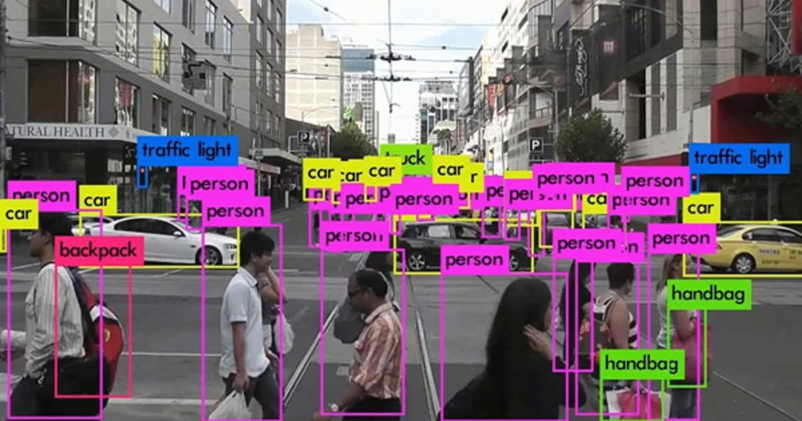

# Project 2 Person Tracking

## Latar Belakang
Jumlah manusia pada kota besar sangatlah banyak. Orang yang berkerumun sering kali bisa menjadi cekcok atau tawuran. Oleh karena itu dibutuhkan sistem untuk mendeteksi atau melacak orang-orang yang berada pada titik tertentu secara otomatis guna mendukung keamanan kota. 

## Informasi Umum
Dalam Project ini saya mencoba implementasikan YoloV3([paper](https://arxiv.org/abs/1804.02767)|[code](https://github.com/ultralytics/yolov3)) untuk person tracking menggunakan datasets [coco dataset](https://cocodataset.org/) yang diambil menggunakan library [FiftyOne](https://docs.voxel51.com/). 

## Strategi Kriteria Uji
Proses implementasi:
1. Import library-library
2. Download dataset (coco dataset) dengan menggunakan FiftyOne dengan jumlah data train 3000 dan data test 500
3. Membuat function DataLoader menyesuaikan dengan coco dataset
4. Membuat Model YoloV3
5. Membuat function YoloLoss untuk menghitung loss function
6. Melakukan training model
7. Melakukan evaluasi model dengan mAP

## Kesimpulan
Dalam Project ini saya mendapatkan mAP sebesar **0.00501** dengan epoch 50

